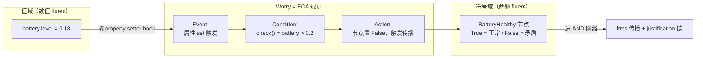
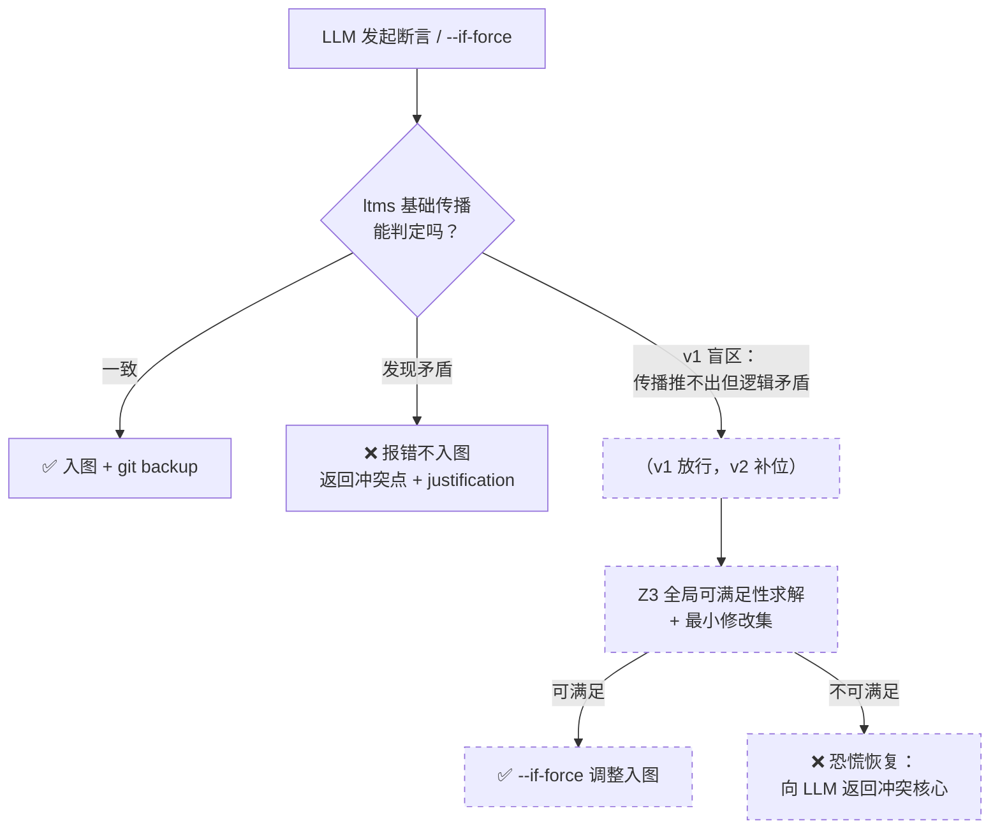
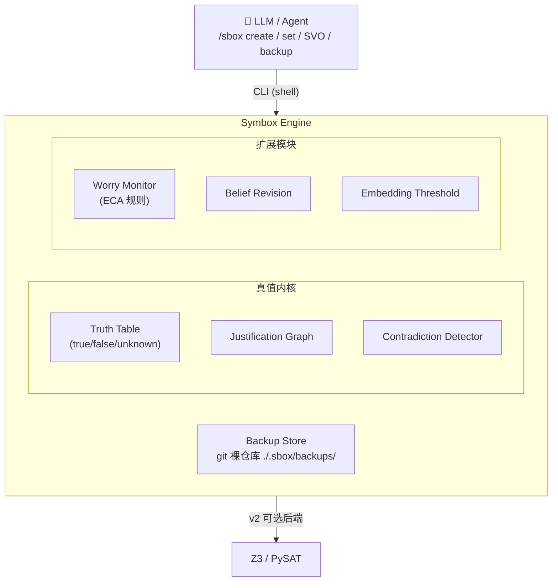

# Symbox 设计规范 v0.4 — 语法驱动的符号推理沙盒

> **日期**: 2026-07-30
> **作者**: Tony（概念设计）/ Toni（整理）
> **状态**: CLI 接口 + 阈值检测 Adj + snapper 式 backup 确定；Worry 极性修正 + 学术血统修正 + v1/v2 分层
> **关联**: GitHub Issue #1（开题）, #6（学术引用调研）, #7（Worry 形式化）, `symbox-heritage-research.md`（工具调研）

---

## 1. 核心哲学

Symbox 用**自然语言的语法范畴**（主-谓-形-标签）做知识表示的类型系统，Python OOP 做实现载体，ltms 式真值传播做推理引擎。

LLM 通过 **CLI tool** 操作这些语法对象——shell 原生、pipe 组合、任何 agent 框架都能调。系统自动维护逻辑一致性，幻觉在产生时就被拦截。

**设计原则**：语法范畴（主语/动词/Adj/tags）是**内部建模的本体论**，不是**输入格式**。LLM 面对的是简洁的 CLI 命令，底层引擎用主谓形标签组织知识——两层各归各位。

---

## 2. 对象类别

| 类别 | 定位 | 逻辑对应 | OOP 实现 |
|------|------|---------|---------|
| **主语类 (S)** | 可自定义注册的实体类型 | 个体常量 | 普通 Python class |
| **动词类 (V)** | 自带逻辑注册的谓词，调用时对 S 和 O 施加内部规则 | n 元谓词 + 公理 | class，实例化 = 断言一条关系 |
| **Adj 类** | 动词规则的"补丁包"，存储在主语内 | 一元谓词 | 主语的 attribute / mixin |
| **tags 类** | 对 Adj 的聚类，用于快速描述主语 | 类型（many-sorted logic 的 sort） | class-level 标签 |

**手动关系创建**: LLM 可直接 `Verb(subject, obj)` 实例化一条关系，等价于断言基元事实（ground fact）。

---

## 2.5 CLI 接口规范（LLM 的操作界面）

LLM 通过 CLI 操作 Symbox，每个命令是一个原子事务：

### 对象生命周期
```bash
/sbox create [obj_name]
/sbox delete [obj_name]
```

### 函数绑定（动词规则 / Adj 语义 / Worry 条件）
```bash
/sbox bind [obj_name] [func_name] -f src.py [--verb]
/sbox unbind [obj_name] [func_name] [--verb]
```

**bind 函数签名**（约定）：
```python
def check(s, o) -> bool:
    """s: 主语属性 dict, o: 宾语属性 dict。返回 True 通过，False 矛盾"""
    ...
```

**verb 标记**：`--verb` 标记的 obj 才能站在动词位（`S V O` 中的 V）。verb 和 adj 存储等价，仅标记区分。

**Worry 实现**：继承 `Worry` class 写检查函数，bind 到对象上，无需特殊处理。`check()` 极性遵循 §3.1 约定：True = 正常，False = 触发矛盾。
```python
class BatteryHealthy(Worry):
    def check(self, s, o):
        return s.get("battery", 1.0) > 0.2  # True = 正常，False = 触发传播
```

### 属性操作（带阈值检测）
```bash
/sbox set [obj_name] ['k':'v','k2':'v2'] [--force]
/sbox unset [obj_name] ['k','k2']
```

**阈值检测**：新 key 与现有 key 的 embedding 相似度 > `SIMILARITY_THRESHOLD`（默认 0.9，`.env` 可调）时，返回确认请求：
```json
{"status": "confirm_needed", "question": "\"Fixed\" 与现有 \"Broken\" 高度相似，是反转还是新增？", "target": "laptop", "existing": "Broken", "proposed": "Fixed"}
```
LLM 确认后加 `--force` 强制执行。

### SVO 断言
```bash
/sbox [obj_S] [obj_V] [obj_O] [--if-force]
```

默认触发 ltms 检查，矛盾则报错不入图。`--if-force` 视其为条件，把其他冲突点"按下葫芦浮起瓢"（自动调整使断言成立）。

**原子性**：有报错都不入图，只有成功才更新图。

### 查询
```bash
/sbox list ["objects"|"verbs"|"backups"|obj_name]
```

## 2.6 Backup 版本控制（snapper 语法）

借鉴 snapper 的语法，底层调用 git 实现磁盘持久化：

```bash
/sbox backup create 'note-as-id'      # 打快照
/sbox backup delete ['id1','id2']     # 删除快照
/sbox backup rollback 'note-as-id'    # 回滚到快照
/sbox backup log                      # 查看快照历史
```

**存储位置**：`./.sbox/backups/`（项目本地，git 裸仓库）。

**与 v0.2 三层结构的映射**：
| 层 | CLI 实现 |
|---|---------|
| Committed | 默认操作，成功即入图 |
| Hypothetical | `backup create` → 实验操作 → `backup rollback` |
| Conflict | 非零 exit + stderr / 零 exit + JSON `{status: "conflict", conflicts: [...]}` |

**设计哲学**：Unix 哲学——一切是文件，版本控制用 git，agent 生态原生。

---

## 3. 超现实主语（注册范围不限于物理实体）

主语可以是抽象的、元认知的，用于在沙盒中建模逻辑判定：

### 3.1 Worry 对象 — 值域→符号域的桥

**问题**: ltms 只懂符号真值（`rain=true`），不懂值（`temperature=38.5`）。现实中大量矛盾发生在值域：`battery.level=0.05` ∧ `Executes(robot, task)=true` 在符号层完全自洽，值域里却矛盾。

**方案**: Worry 监控主语的值，将值条件编译成符号真值，接入传播网络。ltms 引擎一行不用改，感知范围扩展到值域。

**极性约定（v0.4 修正）**: `check()` 返回 **True = 状态正常 / 校验通过**，**False = 触发矛盾传播**。LLM 只写"正确情况"的谓词，返回的 bool 直接进外部 AND 网络，无需取反，justification 链语义统一（"链断了 = 某健康条件不满足"）。

```python
# 概念示意：节点语义 = "电池健康"
class BatteryHealthy(Worry):
    def check(self, s, o):
        return s.get("battery", 1.0) > 0.2  # True = 正常；False = 电量过低，触发传播
```

**形式化定位（学术锚点）**: Worry 在机制上是 **ECA 规则**（Event-Condition-Action，Paton & Díaz 1999）：属性 set 是 Event，`check()` 是 Condition，节点翻转触发传播是 Action。被监控的值（`battery.level`）是数值 fluent，派生的健康节点是命题 fluent——但 Worry 监控器本身不是 fluent。详见 §5 血统表。



### 3.2 Attention 对象 — 元认知上下文

建模当前注意力焦点，让系统能推理"如果我关注 X，相关后果是什么"。这让 Symbox 从被动知识库变成有自我模型的推理体，是元认知推理的入口。

### 3.3 类型隔离

主语 class 加 `kind` 标记，动词的 domain/range 校验 kind，防止无意义组合：

| kind | 示例 | 规则 |
|------|------|------|
| `physical` | Person, Apple | 普通动词可作用 |
| `abstract` | Property, Relation | 部分动词可作用 |
| `meta` | Worry, Attention | 普通动词不可作用 |

---

## 4. 设计决策

### 4.1 动词规则的触发时机

| 选项 | 机制 | 优点 | 缺点 |
|------|------|------|------|
| A | 实例化即检查（`Eats(person, apple)` 一创建就抛异常） | 即时反馈 | 只能抓单关系矛盾，跨关系矛盾漏掉 |
| **B（已拍板）** | 注册到全局引擎，统一传播调度 | 能发现跨关系矛盾，复用 ltms 传播算法 | 需要引擎基础设施 |

### 4.2 Adj 阈值检测设计（已拍板）

Adj 是 dict，支持多属性共存，显式声明为主，embedding 阈值检测兜底：

```python
laptop.adj = {
    "Broken": {"value": True, "since": "2026-07-25T10:00", "justification": [...]},
    "Fixed": {"value": False, "since": None, "justification": []},
    "Old": {"value": True, "since": "2026-07-25T09:00", "justification": [...]},
}
```

| 方式 | 场景 | 机制 |
|------|------|------|
| **显式 set（主）** | LLM 知道当前状态 | `/sbox set laptop ['Fixed':true]` 直接写入 |
| **阈值检测（辅）** | 新 key 与现有 key 相似度 > `SIMILARITY_THRESHOLD` | 返回确认请求，LLM 加 `--force` 裁决 |

**阈值检测价值**: 显式 set 保证效率，阈值检测在 LLM 状态记忆模糊时被动触发，防止 `"Fixed"` 和 `"Broken"` 这类近义/反义 key 同时溜进主图造成不一致。

**Embedding 配置**（复用 TimeIndex 方案，`.env` 控制）：
```bash
EMBEDDING_BASE_URL=https://api.openai.com/v1  # 或 http://localhost:11434/v1 (Ollama)
EMBEDDING_API_KEY=***
EMBEDDING_MODEL=text-embedding-3-small  # 或 nomic-embed-text (Ollama)
SIMILARITY_THRESHOLD=0.9
```
未配置或调用失败时降级为精确字符串匹配，阈值检测自动禁用。

**Adj patch 的两种语义**（保留）：
- **拦截型 (veto)**：直接阻止动词成立 → 矛盾（如 `Rotten` 阻止 `Eats`）
- **修饰型 (modify)**：动词成立但附加后果（如 `Eats(rotten_apple)` → `Sick(person)`）

### 4.3 tags 动态派生 vs 手动打标

| 方式 | 机制 | 场景 |
|------|------|------|
| **动态为主（已拍板）** | Adj 声明 `implies_tags=["food"]`，挂载时自动派生 | 推理自动性 |
| 手动兜底 | LLM 直接给主语打 tag | 灵活性、快速标注 |

### 4.4 Worry 的触发机制

| 选项 | 机制 | 优点 |
|------|------|------|
| **A（已拍板）** | Observer：值变化立即触发（主语的值走 `@property` setter hook） | 实时 |
| B | 每轮传播结束后全量重评估 | 兜底，保证边界情况不漏 |

**已定**: A 为主，B 兜底。

### 4.5 真值存在哪？（⭐ 地基问题）

ltms 的精髓：每个节点有 **true / false / unknown** 三态，justification 记录"它为什么为真"，撤回时沿 justification 链自动修正。

| 选项 | 机制 | 评价 |
|------|------|------|
| **A（已拍板）** | **引擎持有真值**：对象是"事实的句柄"，真值表 + justification 图住在引擎里。`del` 对象 → 引擎标记 retracted → 沿依赖链传播修正 | justification 链是跨对象的全局结构，集中管理才一致 |
| B | 对象持有真值：每个对象自带 truth 和 dependents，自己管理传播 | 状态分散，跨对象依赖链无法维护 |

**A 的本质**: 主语/动词/Adj 是**语法外壳**（LLM 的操作界面），引擎是**语义内核**（真值传播）。呼应"语言层 → 逻辑层"的整体直觉。

### 4.6 输入格式（已拍板）

| 选项 | 评价 |
|------|------|
| 自然语言解析 | ❌ 脱裤子放屁，LLM 不需要"组织语言" |
| 标准 JSON | ❌ 不够 agent 原生，pipe 组合能力弱 |
| **CLI tool（已拍板）** | ✅ shell 原生、pipe 组合、任何 agent 框架都能调 |

**三层结构**：
| 层 | 机制 | CLI 对应 |
|---|------|----------|
| Committed | 校验通过写入主图 | 普通 `create`/`set`/`SVO` |
| Hypothetical | 假设层操作 | `backup create` → 操作 → `backup rollback` |
| Conflict | 校验失败报错 | 非零 exit + stderr / 零 exit + JSON `{status, conflicts}` |

**原子事务**: 每个 CLI 命令是一个原子事务，成功才更新图。

---

## 5. 设计来源与可引用依据

> 本表说明设计元素有可追溯的学术/工程来源，**不构成对 Symbox 实现正确性的证明**。引用边界经 Issue #6/#7 调研逐条核查。

| 传统 | 对应 | 年份 |
|------|------|------|
| 语义网络 (Semantic Networks) | 主语 + 关系 = 节点 + 边 | Quillian 1966 |
| 格语法 (Case Grammar) | 动词的论元角色约束（三槽位为刻意工程简化，非完整实现） | Fillmore 1968 |
| FrameNet | 动词框架 + 角色填充 | 1990s- |
| Truth Maintenance System | 真值传播 + 信念修正 | Doyle 1979, de Kleer 1986 |
| ECA 规则 (Active Databases) | Worry：属性变化(Event) → 条件检查(Condition) → 派生事实(Action) | Paton & Díaz 1999 |
| Fluent (situation calculus) | 被监控的数值属性（数值 fluent）与派生健康节点（命题 fluent） | McCarthy & Hayes 1969 |
| 认知架构 (SOAR/ACT-R) | Attention 元认知 | 1980s- |
| Git / Snapper | Backup 版本控制 | 2005 / 2011 |

---

## 6. 架构预览

### 6.0 v1 / v2 能力分层（v0.4 新增）

| | **v1（当前）** | **v2（后续）** |
|---|---|---|
| **目标** | Sandbox 建模操作：LLM 写事实、查状态、基础矛盾当场拦截 | 恐慌恢复：LLM 信念打架时，符号推理带它冲出泥潭 |
| **引擎** | ltms 基础传播（健全但不完备，深层矛盾可能漏） | Z3 全局可满足性求解 + `--if-force` 最小修改集 |
| **Worry** | ECA 单阈值，bool 极性（§3.1） | 可选扩展：landmark 区间 + 趋势（借鉴 QSIM 表示，非完整定性模拟） |
| **矛盾覆盖** | 传播链可达的矛盾 | 传播链推不出、但逻辑上确实矛盾的盲区 |

**分工原则**：v1 不追求完备性——漏掉深层矛盾不致命，快速反馈才致命。v2 的 Z3 是"什么都能发现但慢"的兜底，仅在 LLM 聊 panic / `--if-force` 时调用。



> 虚线 = v2 才上线的路径；v1 阶段只有实线部分。

### 6.1 架构图



**数据流**：
1. LLM 执行 `/sbox set laptop ['Fixed':true]`
2. 引擎检查 embedding 阈值（`Fixed` vs `Broken` 相似度 0.92 > 0.9）
3. 返回确认请求，LLM 加 `--force` 确认
4. 引擎更新 Adj dict，沿 justification 链传播
5. 自动触发 git commit（backup）

---

## 7. 下一步

- [x] Tony 拍板核心设计决策（§4 全部已定）
- [x] Worry 极性修正 + 学术血统核查 + v1/v2 分层（v0.4，经 Issue #6/#7 调研）
- [ ] Tony 亲自 code Layer 0 核心引擎（CLI 接口 + ltms 传播 + git backup）
- [ ] 画 draw.io 宏观架构图（Issue #1 任务①）
- [ ] 复用 TimeIndex embedding_provider 到 Symbox
- [ ] 实现 `.env` 配置加载（SIMILARITY_THRESHOLD / EMBEDDING_*）
- [ ] 格语法深挖专场（Issue #8，另开 chat 讨论 SVO 三槽位 vs case frame 的关系）

---

*v0.4 — 2026-07-30 by Toni：Worry check() 极性修正（True=正常）、血统表修正（Worry→ECA/Paton&Díaz 1999、fluent 行精确化、Snapper 2008→2011、格语法加边界声明）、新增 §6.0 v1/v2 分层（ltms 日常传播 / Z3 恐慌恢复）。基于 Issue #6 学术背调 + Issue #7 四篇原论文核查。*
*v0.3 — 2026-07-25 by Toni，基于 Tony 的 CLI 设计 + 阈值检测 Adj + snapper 式 backup 整理*
