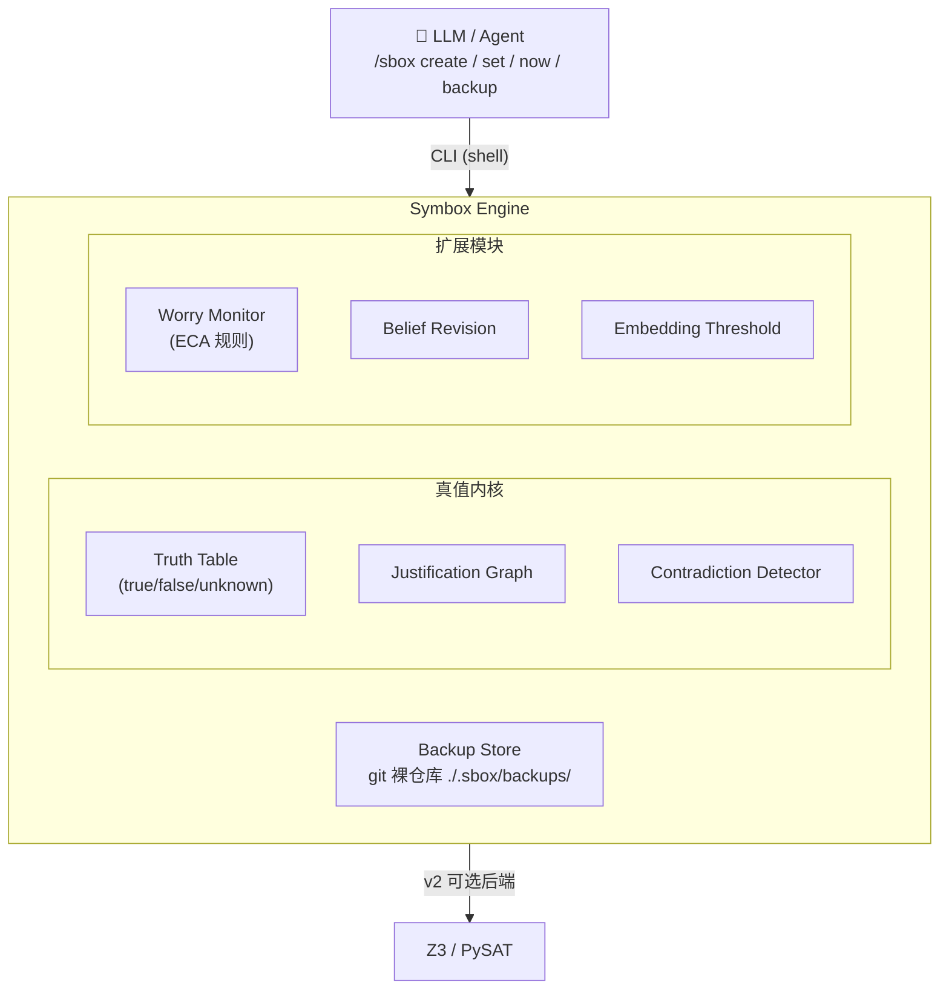

# Symbox 设计规范 v0.6 — SVK 变长论元格式

> **日期**: 2026-08-18
> **作者**: Tony（概念设计）/ Toni（整理）
> **状态**: Issue #8 格语法专场拍板——SVO 三槽位重构为 SVK 变长格式；CLI `svo` 改名 `now`；格语法术语不进 Symbox
> **关联**: v0.5（引擎路线继承）、GitHub Issue #8（格语法深挖）、`references/case-grammar-fillmore.md`（专场知识库）
> **与 v0.5 的关系**: 除 §2 对象类别与 §2.5 CLI 接口重写外，v0.5 的全部已拍板决策（TruthKernel 接缝、v1/v1.5/v2 分层、契约测试 C1–C8、命名空间为架构决策）**原样继承**。本文只记录增量与修正。

---

## 0. 版本摘要

v0.6 的唯一主题：**SVO 三槽位解构为 SVK 变长论元格式**。

Issue #8 格语法专场的核心发现：Fillmore 1968 的深层格（deep case）理论不必进 Symbox，但其三槽位瓶颈必须解决。拍板方案：

- **S** = 前槽位，唯一，结构性存在
- **V** = 动词，核心，决定后方论元包的解析方式
- **K** = 论元包（kwargs），变长，`len(k) >= 0`

`SVO` 是 `SVK` 在 `len(k)=1` 时的特例。`len(k)=0` 表示自我修改（`the door opened`）。

**CLI 同步改名**：`/sbox svo` → `/sbox now`——"now" 承载断言的时态暗示（当下事实），且比 "svo" 更短、更 agent 原生。

---

## 1. 格语法专场结论（Issue #8）

### 1.1 根本分叉拍板

| 分叉 | 选项 | 结论 |
|---|---|---|
| Symbox 的 S/O 本体论 | A. 表层句法槽位（主语/宾语） | ✅ **拍板** |
| | B. 深层格角色（Agentive/Instrumental/...） | ❌ 拒绝 |

**拒绝 B 的理由**：Fillmore 的深层格是表层句法学家的分析框架，Symbox 不需要继承。LLM 用户自然产出的 "the door opened" 在 Symbox 里就是合法的自我修改断言，无需"O 提升到主语位"那套深层机制解释。

**但 A 的局限必须解决**：三槽位无法覆盖多论元结构（`give Mary a book` 双宾、`buy from Mary for $5000` 五元）。解法不是引入深层格，而是**解构 O 为变长论元包 K**。

### 1.2 格语法的唯一遗产

Fillmore 的**单格唯一性公理**（同一句子中同一个格只能出现一次）在 SVK 下**天然成立**——Python 函数签名 `f(x=1, x=2)` 是 SyntaxError。Verb 类作者自定义参数名，同名参数二次填充 = 结构性冲突，无需专门设计。

**格语法术语（Agentive/Instrumental/Dative/Factitive/Locative/Objective）不进 Symbox**。Verb 类作者想叫 `source`/`target`/`price`/`with_what` 都行，只要 Python 函数签名能接住。

### 1.3 四大开放挑战状态

| 挑战 | 状态 | 说明 |
|---|---|---|
| 1. 动词多义/格框架膨胀 | ✅ **化解** | SVK 下同一 Verb 可注册多个 case frame（Python 函数重载/装饰器），或拆类（`OpenAgentive` vs `OpenInstrumental`），规模可控 |
| 2. SVO 三槽位瓶颈 | ✅ **化解** | SVK 变长 K 覆盖任意元数 |
| 3. check()/apply_effect() 副作用耦合 | ⏸️ **独立问题** | 与 SVK 无关，另开讨论 |
| 4. 隐性范畴误杀 | ⏸️ **独立问题** | 与 SVK 无关，另开讨论 |

---

## 2. 对象类别（v0.6 重写）

| 类别 | 定位 | 逻辑对应 | OOP 实现 |
|------|------|---------|---------|
| **主语类 (S)** | 可自定义注册的实体类型 | 个体常量 | 普通 Python class |
| **动词类 (V)** | 自带逻辑注册的谓词，调用时对 S 和 K 施加内部规则 | n 元谓词 + 公理 | class，实例化 = 断言一条关系 |
| **Adj 类** | 动词规则的"补丁包"，存储在主语内 | 一元谓词 | 主语的 attribute / mixin |
| **tags 类** | 对 Adj 的聚类，用于快速描述主语 | 类型（many-sorted logic 的 sort） | class-level 标签 |

**SVK 类**（v0.6 新增，替代 SVO）：

```python
class SVK:
    s: Subject  # 第一论元，CLI 输入时独立
    v: Verb  # 动词，核心
    kwargs: dict[str, Any]  # 其余论元，check() 时 S 作为独立第一参数传入
    justification: TmsNode  # 引擎节点引用
```

**kwargs 解析**：Verb 收到 `check(S, **kwargs)`，S 是显式独立第一参数，必须处理；kwargs 为其余论元。`len(kwargs)>=0`（可空）。自我修改时 `kwargs={}`，仅 S 传入。

**设计原则不变**：语法范畴（主语/动词/Adj/tags）是**内部建模的本体论**，不是**输入格式**。LLM 面对的是简洁的 CLI 命令，底层引擎用 SVK 组织知识——两层各归各位。

---

## 2.5 CLI 接口规范（v0.6 重写）

LLM 通过 CLI 操作 Symbox，每个命令是一个原子事务：

### 对象生命周期
```bash
/sbox create [obj_name]
/sbox delete [obj_name]
```

### 函数绑定（动词规则 / Adj 语义 / Worry 条件）
```bash
/sbox bind [obj_name] [func_name] -f src.py [--verb]
/sbox unbind [obj_name] [func_name] [--verb]
```

**bind 函数签名**（约定，v0.6 扩展）：
```python
def check(S, **kwargs) -> bool:
    """S: 第一论元（必须显式处理），kwargs: 其余论元。返回 True 通过，False 矛盾"""
    ...
```

**约束**：S 不是可省略的 kwargs 之一，是函数签名里显式存在的第一参数。Verb 至少要写对 S 的逻辑。

**verb 标记**：`--verb` 标记的 obj 才能站在动词位（`S V K` 中的 V）。verb 和 adj 存储等价，仅标记区分。

**Worry 实现**：继承 `Worry` class 写检查函数，bind 到对象上，无需特殊处理。`check()` 极性遵循 §3.1 约定：True = 正常，False = 触发矛盾。

### 属性操作（带阈值检测）
```bash
/sbox set [obj_name] ['k':'v','k2':'v2'] [--force]
/sbox unset [obj_name] ['k','k2']
```

**阈值检测**：新 key 与现有 key 的 embedding 相似度 > `SIMILARITY_THRESHOLD`（默认 0.9，`.env` 可调）时，返回确认请求。LLM 确认后加 `--force` 强制执行。

### SVK 断言（v0.6 新增，替代 SVO）
```bash
/sbox now [obj_S] [obj_V] [k...] [kwarg=value...] [--if-force]
```

**示例**：
```bash
/sbox now john give mary book              # k=(mary, book)，位置论元
/sbox now john buy car source=mary price=5000   # k=(car,), kwargs={source, price}
/sbox now door open                        # k=()，自我修改
```

**原子性**：有报错都不入图，只有成功才更新图。

**参数缺失**：Verb 内部函数用 Python 原生 `key:type=default_value` 格式填充；硬缺失（无默认值的必填参数未给）报错透传——"你有关键参数没给，请重试"。

### 查询
```bash
/sbox list ["objects"|"verbs"|"backups"|obj_name]
```

---

## 2.6 引擎 key 规范（v0.6 新增）

**key 形态**：`SVK:hash`

- `hash` = `kwargs` dict（含 S）规范化序列化后的 SHA-256 前 6 位

**规范化**：`sorted(kwargs.items())` 确保同义不同序的调用产生相同 hash。S 作为 `"S"` 进 kwargs，无特权位。

**示例**：
```
SVK:7f3a9c2b      # S=john, kwargs={"v": give, "o": mary, "theme": book}
SVK:e2b8d1f4      # S=john, kwargs={"v": buy, "o": car, "source": mary, "price": 5000}
SVK:0a1b2c3d      # S=door, kwargs={"v": open}，自我修改
```

**设计理由**：
- 纯 hash，人类不可读，但 LLM 也不读 key——key 只是引擎层的 uuid
- OOP 本体承载全部语义（k 元组、kwargs 字典、Adj 绑定）
- 同例历史 = 同 hash，就地算即可
- 位置论元平等（`give` 的 o1/o2 无特权），hash 输入包含完整 k 元组

**命名空间**（v0.5 继承，v0.6 扩展）：
```
Subject:x        # 主语节点
Adj:x:k          # 属性节点
SVK:s:v:hash     # 关系节点（v0.6 替代 SVO）
Worry:x          # 担忧节点
```

---

## 3. 超现实主语（v0.4 继承，无修正）

主语可以是抽象的、元认知的，用于在沙盒中建模逻辑判定：

### 3.1 Worry 对象 — 值域→符号域的桥

**极性约定（v0.4 修正，v0.6 继承）**: `check()` 返回 **True = 状态正常 / 校验通过**，**False = 触发矛盾传播**。

```python
class BatteryHealthy(Worry):
    def check(self, s, *k, **kwargs):
        return s.get("battery", 1.0) > 0.2  # True = 正常；False = 触发传播
```

**形式化定位**: Worry = ECA 规则（Event-Condition-Action，Paton & Díaz 1999）。

### 3.2 Attention 对象 — 元认知上下文

（v0.4 继承，无修正）

### 3.3 类型隔离

（v0.4 继承，无修正）

---

## 4. 设计决策（v0.4/v0.5 继承，v0.6 新增）

### 4.1 动词规则的触发时机

（v0.4 继承：B 方案，注册到全局引擎统一传播调度）

### 4.2 Adj 阈值检测设计

（v0.4 继承，无修正）

### 4.3 tags 动态派生 vs 手动打标

（v0.4 继承，无修正）

### 4.4 Worry 的触发机制

（v0.4 继承，无修正）

### 4.5 真值存在哪？

（v0.4 继承：A 方案，引擎持有真值。v0.5 推进：内核本身可替换）

### 4.6 输入格式

（v0.4 继承：CLI tool。v0.6 扩展：`now` 命令支持 SVK 变长论元）

### 4.7 SVK 论元包设计（v0.6 新增）

| 决策点 | 结论 | 理由 |
|---|---|---|
| 论元包存储位置 | OOP 本体，kwargs dict | 引擎 key 只是 uuid，语义全在对象 |
| 论元包结构 | kwargs dict 存其余论元，S 独立字段存储 | CLI 输入时 S 独立，check() 时 S 作为显式第一参数 |
| S 的槽位特权 | 有，S 是显式第一参数，必须处理 | Verb 至少要写对 S 的逻辑，S 不可省略 |
| 参数缺失处理 | Python 原生 `key:type=default_value`，硬缺失报错透传 | 不发明新语义，复用 Python 函数调用约定 |
| 格角色名称 | 开放，Verb 类作者自定义 | Fillmore 术语不进 Symbox |
| 单格唯一性 | Python 函数签名天然保证 | `f(x=1, x=2)` SyntaxError，无需专门设计 |
| 引擎传播粒度 | 粗粒度，SVK 整体一个节点 | v1 不改引擎，论元包内部一致性由 Verb.check() 保证 |

---

## 5. 设计来源与可引用依据（v0.6 更新）

| 传统 | 对应 | 年份 |
|------|------|------|
| 语义网络 (Semantic Networks) | 主语 + 关系 = 节点 + 边 | Quillian 1966 |
| 格语法 (Case Grammar) | 动词的论元角色约束（SVK 为工程简化，非完整实现；深层格术语不采用） | Fillmore 1968 |
| FrameNet | 动词框架 + 角色填充 | 1990s- |
| Truth Maintenance System | 真值传播 + 信念修正 | Doyle 1979, de Kleer 1986 |
| ECA 规则 (Active Databases) | Worry：属性变化(Event) → 条件检查(Condition) → 派生事实(Action) | Paton & Díaz 1999 |
| Fluent (situation calculus) | 被监控的数值属性（数值 fluent）与派生健康节点（命题 fluent） | McCarthy & Hayes 1969 |
| 认知架构 (SOAR/ACT-R) | Attention 元认知 | 1980s- |
| Git / Snapper | Backup 版本控制 | 2005 / 2011 |

---

## 6. 架构预览（v0.5 继承，v0.6 更新）

### 6.0 v1 / v1.5 / v2 能力分层（v0.5 继承，无修正）

| | **v1（当前）** | **v1.5（内核替换）** | **v2（能力扩展）** |
|---|---|---|---|
| **目标** | 验证 CLI 契约 + Sy→LLM 假设 | 换 ATMS 内核，接口零变化 | 恐慌恢复 + 非 Horn 补位 |
| **内核** | pisanuw/ltms（BCP 传播，sound 不完备） | 自写 ATMS（label + nogood DB，Horn 完备） | ATMS + hitting set 诊断 |
| **假设溯源** | assumption 标记（库原生） | label 全量环境 | provenance 查询 CLI |
| **多上下文** | ❌ 单上下文 | ✅ 并存 | ✅ + 分支比较 |
| **矛盾报错** | "与 X 矛盾" | "assumption 集 {A,B,C} 互斥" | + 最小撤回建议 |
| **Z3** | — | — | 非 Horn 声明式规则专用 |
| **Worry** | ECA 单阈值 bool（不变） | 不变 | 可选 QSIM 式 landmark 扩展 |

### 6.1 架构图（v0.6 更新）



**数据流**（v0.6 更新）：
1. LLM 执行 `/sbox now john buy car source=mary price=5000`
2. 引擎解析 SVK：S=john, kwargs={"v": buy, "o": car, "source": mary, "price": 5000}
3. Verb.check(S, **kwargs) 校验论元包内部一致性（Python 层）
4. 引擎生成 key `SVK:e2b8d1f4`，入 justification 图
5. 沿 justification 链传播（Adj veto / Worry requires）
6. 自动触发 git commit（backup）

---

*v0.6 — 2026-08-18 by Toni：Issue #8 格语法专场拍板。核心修正：SVO 三槽位解构为 SVK 变长论元格式（S + V + kwargs，S 为 kwargs 之一无特权位）；CLI `svo` 改名 `now`；引擎 key 改为 `SVK:hash`（kwargs 含 S 规范化序列化）；格语法术语不进 Symbox，单格唯一性由 Python 函数签名天然保证。v0.5 引擎路线（TruthKernel 接缝、ATMS 迁移）全部继承。基于 Fillmore 1968 全文精读 + 五梯度困难例子分析 + Tony 拍板。*
